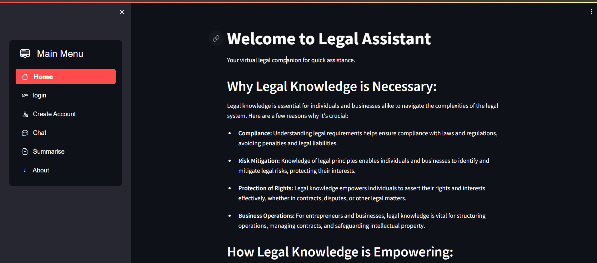
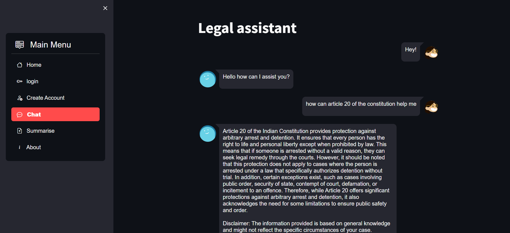
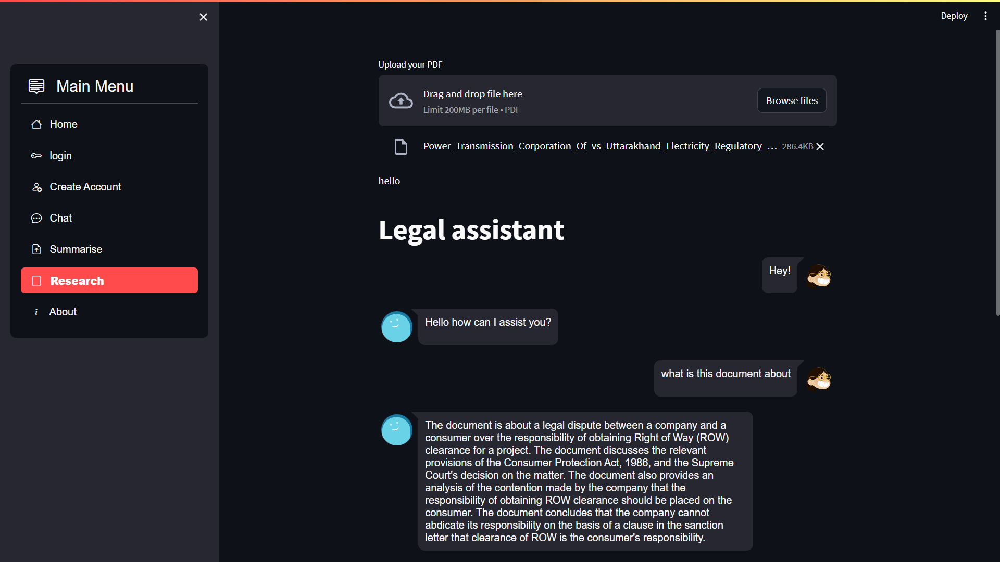

# AI legal Assistant

- This is an Indian legal Assistant application, where you can get your legal doubts cleared, empower yourself with legal knowledge, summarise case files and chat with your legal documents to aid your legal research. 
- This application is powered by RAG with a knowledge base of Indian Union Government acts on top of llama-2-7b-chat model fine tuned on legal datasets


##Prerequisites
Install cuda drivers to access gpu if you are running on your local machine.
Make sure python is installed 
## Usage
 ### 1. Clone the repo
 Open your terminal and clone the repository by :
```bash
git clone https://github.com/Hash-if-vs/Legal-Assistant-Chatbot
 ```
### 2. Navigate to the Repository
### 3. Create a Virtual Environment
It's recommended to use a virtual environment for Python dependencies. Here’s how you can create one (using venv):
```bash
python -m venv .venv
 ```
### 4. Activate the Virtual Environment
Activate the virtual environment. On Windows:
```bash
.venv\Scripts\activate
 ```
 On macOS and Linux:
 ```bash
 source .venv/bin/activate
 ```
### 5.Navigate to the Source Folder
Navigate to the src folder of your project in the terminal:
 ```bash
 cd src
 ```
### 6. Run preprocessing.py
Before running preprocessing.py, ensure you have specified the path to your data directory and the location to store the vector database within the script.
 ### 7. Run initializer.py
- After preprocessing, Create an account in together.ai to access their api key,make sure "together_api_key" variable is set.(An api is used here for accessing llms with large context length for summarisation of huge case files, you can always avoid this by alternatively using any local llms for summarisation)
- Run initializer.py by specifying the path to your vector database:

### 8. Run the application
To run the application locally using Streamlit, type the following command in the terminal:
 ```bash
 streamlit run app.py
 ```
### Additional Notes
- Make sure all dependencies are installed within your virtual environment (pip install -r requirements.txt).
- Adjust file paths and configurations as per your project structure and requirements.
- Try running the jupyter notebooks if you are not running locally on your machine(kaggle notebooks are recommended because of more gpu's available for free)
- Also detailed explaination are given on the notebooks check them out


## Demo
### Homepage


### Chat Interface



### Research Page



